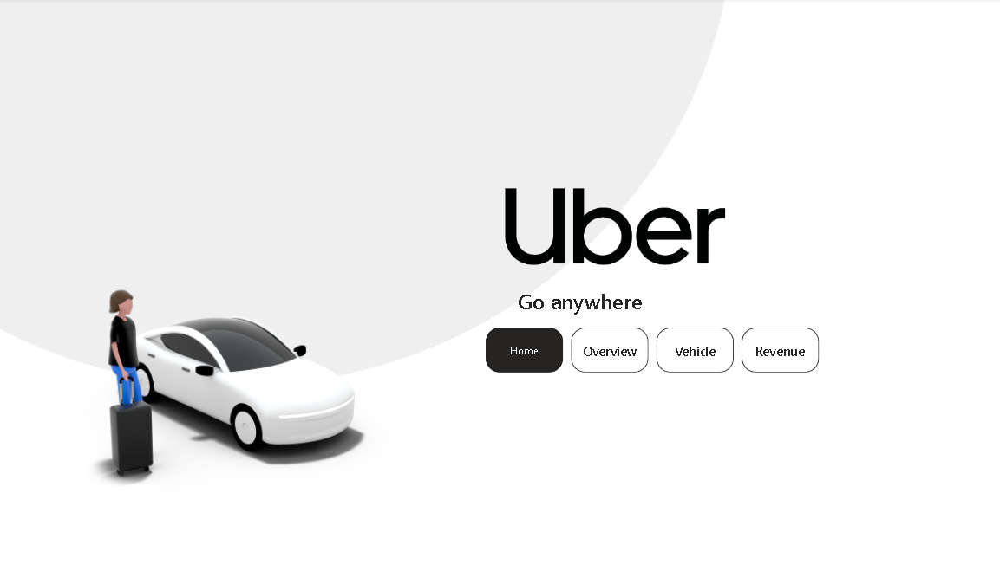
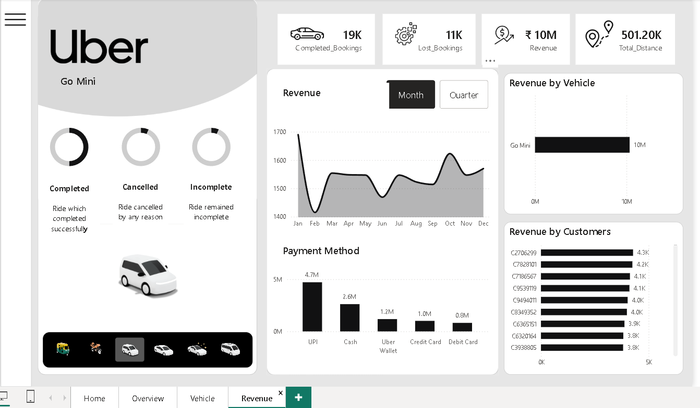
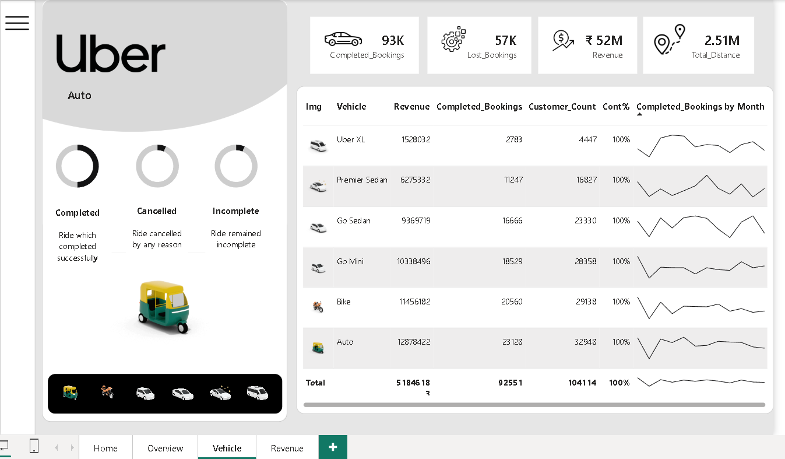
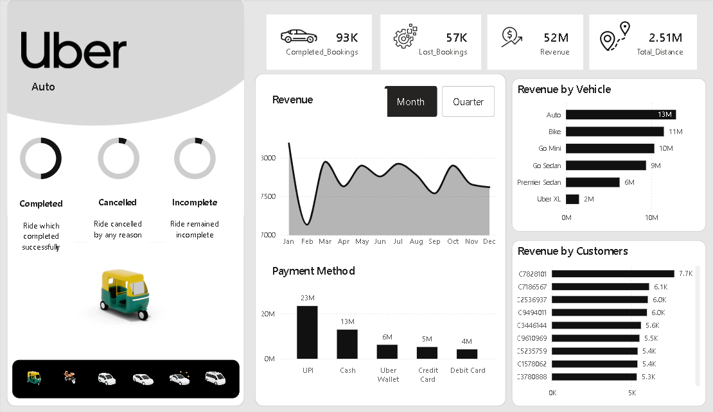

<div align="center">
  
  
  # 🚖 Uber Analytics Dashboard
  
  *A Premium, Interactive Multi-Page Business Intelligence Solution built with Power BI*
  
  <p align="center">
    <a href="https://powerbi.microsoft.com/">
      
    </a>
    <a href="#">
      
    </a>
    <a href="#">
      
    </a>
    <a href="#">
      
    </a>
  </p>
</div>

---

## 📖 Project Overview

This repository hosts a multi-page **Power BI Dashboard** (`Uber Dashboard.pbix`) detailing Uber's booking dynamics, vehicle efficiency, and revenue metrics. Analyzing **150,000+ total bookings**, the dashboard provides actionable business insights through a clean, Figma-designed user interface.

> [!NOTE]
> All background layouts and vehicle indicators were designed using custom visual assets in Figma to reduce cognitive load and provide a modern app-like dashboard experience.

---

## ⚡ Executive Business Metrics

<div align="center">
  <table>
    <tr>
      <td align="center">🚀 <b>Completed Bookings</b></td>
      <td align="center">💰 <b>Total Revenue</b></td>
      <td align="center">🗺️ <b>Total Distance</b></td>
      <td align="center">⭐ <b>Avg Driver Rating</b></td>
      <td align="center">⚠️ <b>Lost Bookings</b></td>
    </tr>
    <tr>
      <td align="center"><code>93K</code></td>
      <td align="center"><code>$52M</code></td>
      <td align="center"><code>2.51M</code></td>
      <td align="center"><code>4.23 / 5.0</code></td>
      <td align="center"><code>57K</code></td>
    </tr>
  </table>
</div>

---

## 📱 Page-by-Page Interactive Walkthrough

Click on each section below to expand and view screenshots along with their key analytical insights.

<details>
<summary><b>🏠 1. Home / Navigation Page</b></summary>
<br />

<p align="center">
  
</p>

*   **Design & Theme:** Clean, minimalist light-mode interface with a modern 3D illustration of a passenger and sedan.
*   **Navigation Matrix:** High-contrast, interactive pill-buttons enabling seamless transitions to **Home**, **Overview**, **Vehicle**, and **Revenue** screens.
</details>

<details>
<summary><b>📈 2. Overview Dashboard</b></summary>
<br />

<p align="center">
  
</p>

*   **Left Sidebar Filter:**
    *   Dynamic category selection featuring custom icons (**Auto**, **Moto/Bike**, **Go Mini**, **Go Sedan**, **Premier Sedan**, **Uber XL**).
    *   **Booking Status Rings**: 3 circular donut charts showing the percentage breakdown of:
        *   **Completed**: Successful ride terminations.
        *   **Cancelled**: Cancelled by passenger or driver.
        *   **Incomplete**: Rides that did not successfully terminate.
    *   Dynamically rendered 3D Auto Rickshaw asset corresponding to the active vehicle category filter.
*   **Main Visuals:**
    *   **Completed Bookings Trend Line**: Illustrates monthly ride frequencies (ranging between 7K to 8K bookings per month) with a dynamic **Month / Quarter** toggle.
    *   **Booking Value Chart**: Columns representing monthly booking values (averaging ~$5M per month).
    *   **Revenue by Vehicle (Ranked)**: Horizontal bar chart showing that **Auto ($13M)** and **Bike ($11M)** are the top earners.
    *   **Top Pickup Location Card**: Highlights the highest-demand pickup zone (**Khandsa** with **949 bookings**).
    *   **Driver Ratings Card**: High-visibility score of **4.23** out of 5 stars with visual star indicators.
</details>

<details>
<summary><b>🚗 3. Vehicle Performance Dashboard</b></summary>
<br />

<p align="center">
  
</p>

*   **Data Grid Matrix:** A structured comparison of all vehicle tiers:
    
    | Vehicle Icon | Vehicle | Revenue ($) | Completed Bookings | Customer Count | Cont % | Monthly Booking Trend |
    | :---: | :--- | :--- | :--- | :--- | :---: | :---: |
    | 🛺 | **Auto** | $12,878,422 | 23,128 | 32,948 | 100% | 📈 Sparkline |
    | 🏍️ | **Bike** | $11,456,182 | 20,560 | 29,138 | 100% | 📈 Sparkline |
    | 🚗 | **Go Mini** | $10,338,496 | 18,529 | 28,358 | 100% | 📈 Sparkline |
    | 🚙 | **Go Sedan** | $9,369,719 | 16,666 | 23,330 | 100% | 📈 Sparkline |
    | 🚘 | **Premier Sedan** | $6,275,332 | 11,247 | 16,827 | 100% | 📈 Sparkline |
    | 🚐 | **Uber XL** | $1,528,032 | 2,783 | 4,447 | 100% | 📈 Sparkline |
    | ➖ | **Total** | **$51,846,183** | **92,551** | **104,114** | **100%** | 📈 Sparkline |
*   **Monthly Sparklines**: Embedded micro-line charts visually outlining the ride frequency trajectory of each vehicle type throughout the year, allowing analysts to instantly spot peak seasons and demand dips.
</details>

<details>
<summary><b>💳 4. Revenue & Transactions Dashboard</b></summary>
<br />

<p align="center">
  
</p>

*   **Revenue Trend Line**: Monthly trajectory mapping earnings over time.
*   **Payment Method Distribution**: A breakdown of user payment mode preferences:
    *   **UPI**: $23M (dominant payment channel)
    *   **Cash**: $13M
    *   **Uber Wallet**: $6M
    *   **Credit Card**: $5M
    *   **Debit Card**: $4M
*   **Top Revenue-Generating Customers**: Horizontal bar chart identifying high-value customers by their system-generated IDs (e.g., Customer **C7828101** leading at **$7.7K**).
</details>

---

## 🛠️ How to Open and Run the Project

### Prerequisites
To view and interact with the dashboard, you need **Power BI Desktop** installed on your system.
*   Download it for free: [Microsoft Power BI Desktop](https://powerbi.microsoft.com/desktop/)

### Quick Start
1.  **Clone the Repository**:
    ```bash
    git clone https://github.com/ashitajha10/Uber-Analytics-Dashboard.git
    cd Uber-Analytics-Dashboard
    ```
2.  **Open the Report**:
    *   Double-click the [`Uber Dashboard.pbix`](Uber%20Dashboard.pbix) file.
    *   Alternatively, open Power BI Desktop, click **File** ➡️ **Open Report**, and select `Uber Dashboard.pbix`.
3.  **Explore**:
    *   Use the navigation buttons on the **Home** page.
    *   Click on the vehicle icons in the sidebar to dynamically filter the visualizations across the **Overview**, **Vehicle**, and **Revenue** sheets.